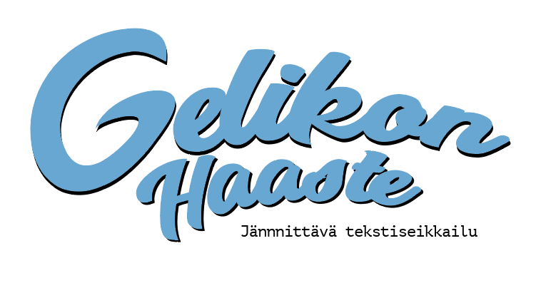

# GelikonHaaste

Lasten oma tekstiseikkailu, helppo koodaa lisää.

Jos haluat tehdä uuden huoneen, kopioi joku olemassa oleva huone kansiosta Huoneet/ ja ala koodaa.

Muutamia hyödyllisiä apureita:

* **Pelimoottori.KirjoitaRuuudulle()** - Piirtää haluamasi tekstin ruudulle
* **Pelimoottori.SuoritaHaaste(Tyyppi.taisteluvoima, 10)** - Suorittaa nopan heiton (20 sivuinen noppa) asettamaasi haastetta ja tyypin taitoa vasten. Palauttaa true/false onnistuiko haaste
* **Pelimoottori.TeeValinta("piiloudu", "juokse", "ei mitään")** - Tekee 3 eri valintaa mistä käyttäjä voi valita. Lisäksi tee switch case (kopioi vaan toisesta huoneesta) mikä käsittelee vaihtoehdot
* **Tyyppi.pisteet += 3** - Lisää pisteitä tyypille (nyt 10 pistettä riittää voittoon)
* **Tyyppi.Kuole()** - Arvaat varmaan, peli loppuu tähän.

Kun huone on valmis, joudut vielä lisäämään sen Program.cs tiedostoon:
Pelimoottori.LataaHuoneet(new Armeija(), new Aarrearkku(), new SunHuone());

Voipi olla vielä vähän haastavaa mutta parannetaan yhdessä!